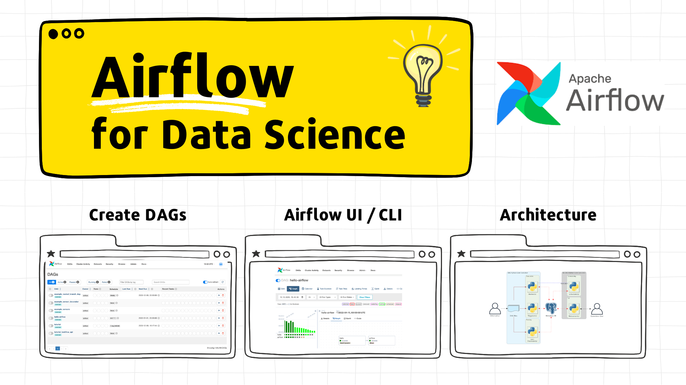
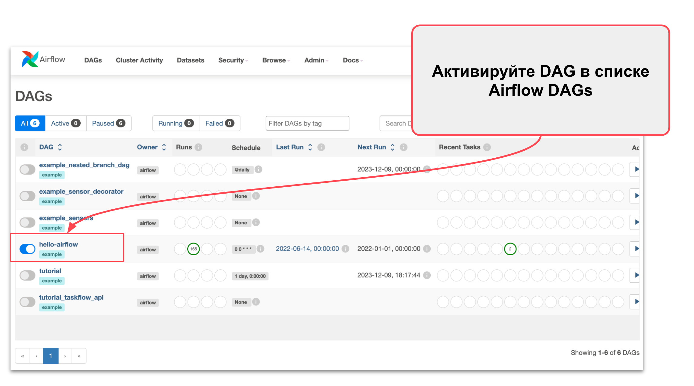
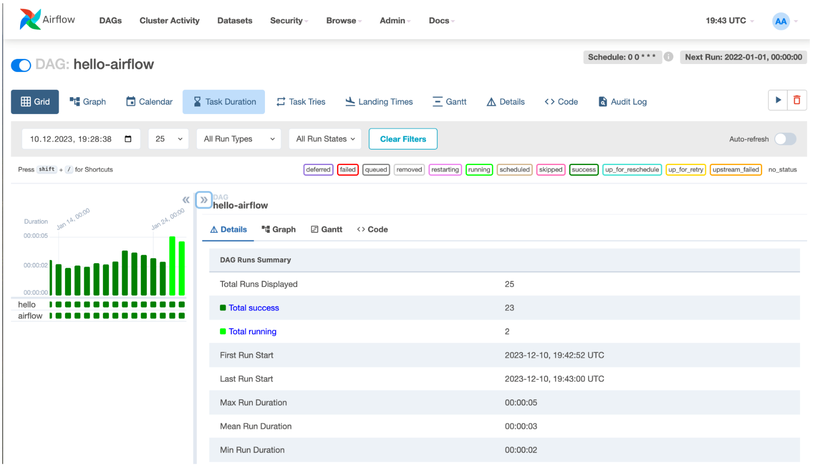
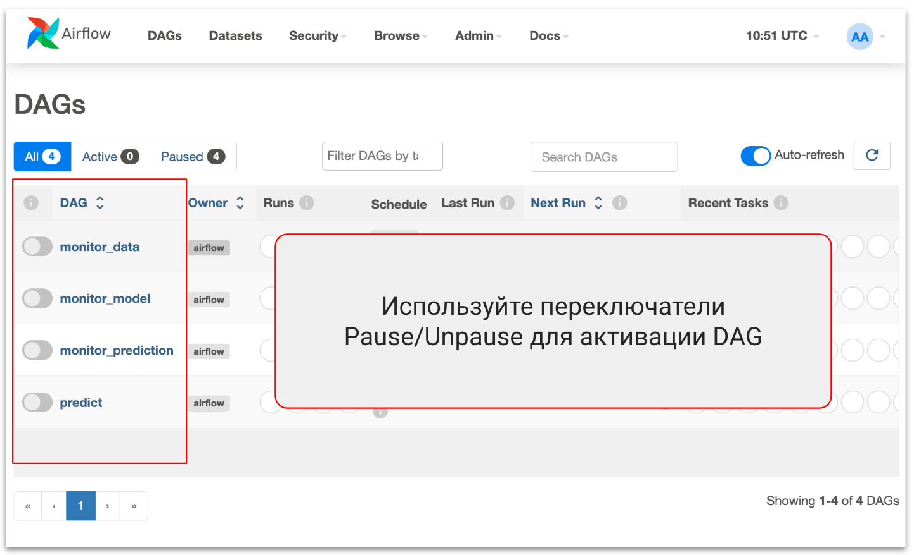
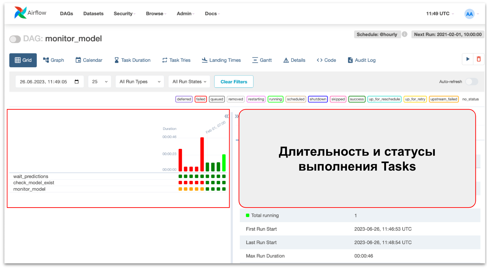
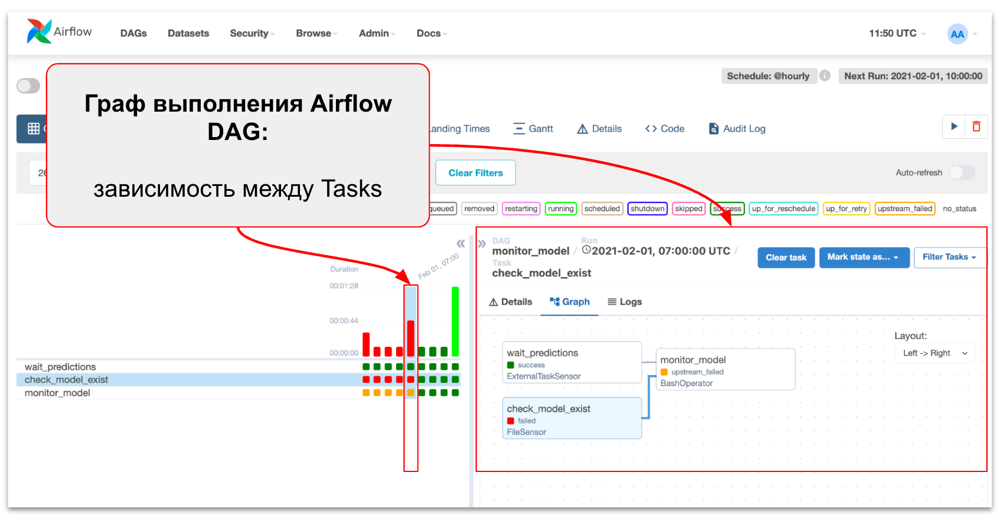
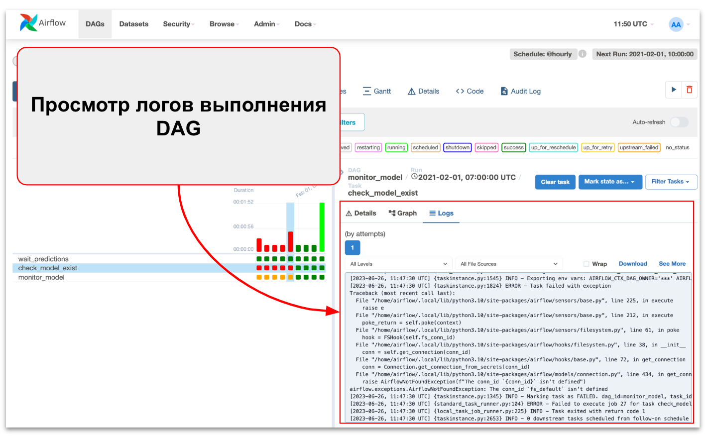
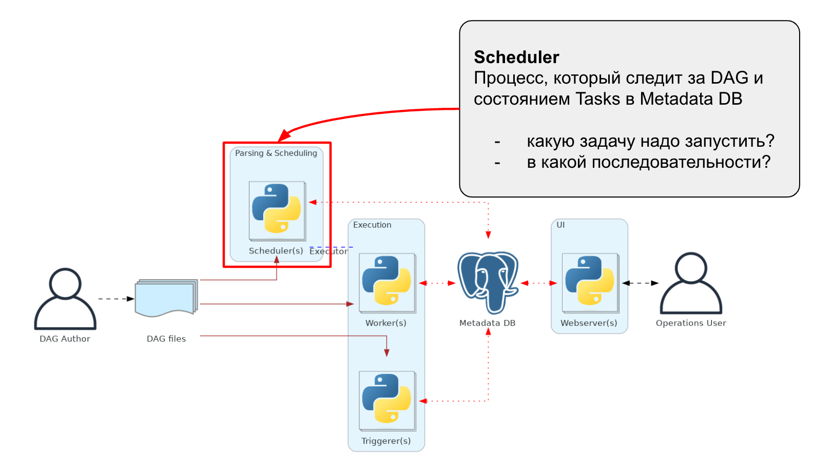
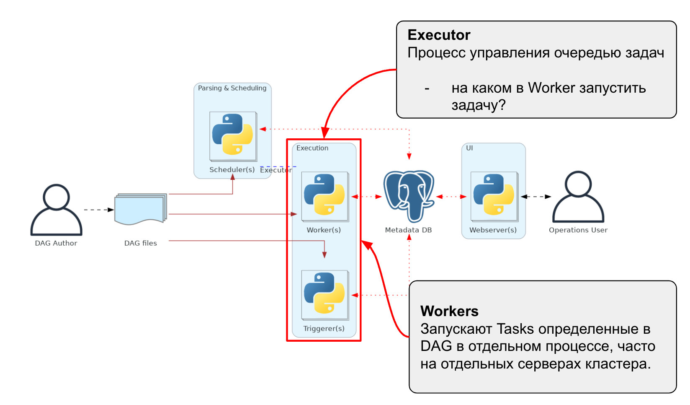
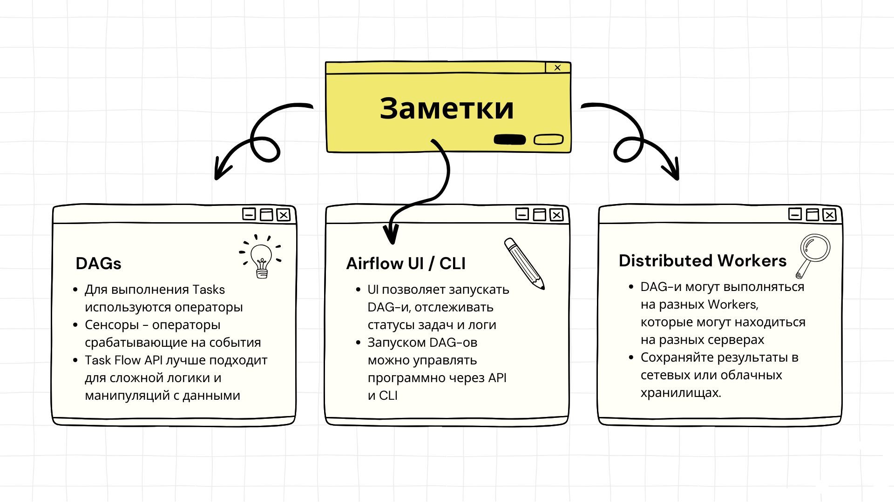

{width=800}

# Tutorial: Основы Airflow для Data Science

## 👀 Описание

🎓 **Что это такое?** Это ваш новый помощник - тьюториал "Основы Airflow для Data Science". Это не просто набор инструкций, а полноценное руководство с примерами, которое научит вас использовать Airflow для Data Science проектов.

Умение работать с Airflow и настраивать пайплайны батч-скоринга позволяет эффективно управлять процессом управления данными и применения ML-моделей. Airflow часто используются для **production** запуска моделей по расписанию в batch режиме.

👩🏻‍💻 **Для кого этот тьюториал?** Если вы Data Scientist или начинающий ML инженер, этот тьюториал создан специально для вас. Он подойдет как тем, кто только начинает знакомство с Airflow, так и тем, кто уже имеет опыт и хочет углубить свои знания.

**🎯 Что вы узнаете?**

В этом тьюториале вы освоите:

1. Установку и запуск Airflow
2. Создание и конфигурация DAG-ов
3. Управление запусками DAG-ов
4. Мониторингвыполнения DAG и анализ логов
5. Архитектура Airflow и MLOps

🔍 **Как это устроено?** Вам не придется долго искать нужную информацию. Тьюториал содержит исчерпывающие примеры кода и пошаговые инструкции в формате Markdown.

⏱️ **Сколько времени нужно?** Всего 30 минут - и вы на шаг ближе к тому, чтобы стать профи в управлении процессами обработки данных и применения ML-моделей c Airflow.

Этот тьюториал - ваш идеальный старт для освоения Airflow. Он даст вам не только теоретические знания, но и практические навыки, которые вы сможете сразу же применить в своей работе. Не упустите шанс улучшить свои компетенции в области Data Science!

Начнем!  `pip install …` 😎

## 📖 Содержание

- [Tutorial: Основы Airflow для Data Science](#tutorial-основы-airflow-для-data-science)
  - [👀 Описание](#описание)
  - [📖 Содержание](#-содержание)
  - [💡 1 - Почему Apache Airflow настолько популярен?](#-1-почему-apache-airflow-настолько-популярен)
  - [👩‍💻 2 - Установка и запуск Airflow](#-2-установка-и-запуск-airflow)
    - [Установка в Docker](#установка-в-docker)
    - [Запуск Airflow](#запуск-airflow)
  - [🛠️ 3 - Создание и настройка автоматического пайплайна (DAG)](#️-3-создание-и-настройка-автоматического-пайплайна-dag)
    - [Основные Элементы DAG](#основные-элементы-dag)
    - [Как это работает](#как-это-работает)
    - [Operators или Task Flow API?](#operators-или-task-flow-api)
  - [🚀 4 - Запуск Airflow DAG: UI, CLI, расписание](#-4-запуск-airflow-dag-ui-cli-расписание)
    - [Запуск через пользовательский интерфейс (UI)](#запуск-через-пользовательский-интерфейс-ui)
    - [Запуск через командную строку (CLI)](#запуск-через-командную-строку-cli)
    - [Автоматическое расписание](#автоматическое-расписание)
  - [📈 5 - Мониторинг запуска: интерфейс, статусы, логи](#-5-мониторинг-запуска-интерфейс-статусы-логи)
    - [Активация DAGs для запуска пайплайнов](#активация-dags-для-запуска-пайплайнов)
    - [Обзор логов и деталей задач](#обзор-логов-и-деталей-задач)
  - [🏗️ 6 - Обзор архитектуры Airflow и его использование в MLOps](#️-6-обзор-архитектуры-airflow-и-его-использование-в-mlops)
  - [🔗 Дополнительные материалы](#-дополнительные-материалы)

## 💡 1 - Почему Apache Airflow настолько популярен?

**Apache Airflow** стал одним из самых востребованных инструментов в мире автоматизации данных и MLOps. Давайте разберемся, почему этот инструмент заслужил такую популярность.

- **Гибкость и мощность:** Airflow предлагает исключительную гибкость для создания, планирования и мониторинга рабочих процессов. С помощью Python можно легко настраивать сложные рабочие процессы (DAGs), которые сочетают в себе различные задачи и зависимости. Airflow обладает способностью масштабироваться для обработки большого объема задач и данных, что делает его пригодным для компаний любого размера.
- **Легкость интеграции:** Airflow обладает встроенной поддержкой множества популярных инструментов и сервисов, таких как AWS, GCP, Azure, а также баз данных и систем мониторинга. Это делает его идеальным инструментом для интеграции разнообразных систем данных.
- **Удобный UI и мониторинг:** Airflow предоставляет интуитивно понятный веб-интерфейс для управления и мониторинга рабочих процессов. Это упрощает отслеживание выполнения задач, анализ логов и быстрое устранение проблем.
- **Применение в MLOps:** В мире MLOps Airflow зарекомендовал себя как мощный инструмент для оркестрации машинного обучения. Он отлично подходит для автоматизации процессов тренировки, тестирования и развертывания моделей ML, а также для управления данными.
- **Открытый исходный код:**  Будучи проектом с открытым исходным кодом, Airflow позволяет пользователям модифицировать и расширять его функциональность, адаптируя под уникальные требования проектов.

Популярность Apache Airflow обусловлена его мощными возможностями для оркестрации рабочих процессов, гибкостью, легкостью интеграции, активным сообществом и применением в различных сферах, от обработки данных до MLOps. Это делает его незаменимым инструментом в арсенале специалиста по данным.

## 👩‍💻 2 - Установка и запуск Airflow

Apache Airflow можно установить как обычную Python-библиотеку или запустить в Docker контейнере. Однако лучшим вариантом является установка в Docker, поскольку это обеспечивает более удобную и стабильную среду.

### Установка в Docker

1. Клонирование репозитория

    Сначала клонируйте репозиторий с примером кода:

    ```bash
    git clone git@gitlab.com:risomaschool/tutorials-raif/airflow-1-get-started.git
    cd airflow-1-get-started
    ```

2. Инициализация cреды

    Перед первым запуском Airflow необходимо подготовить среду:

    - Создайте структуру папок Airflow:

        ```bash
        mkdir -p ./airflow/logs ./airflow/plugins
        ```

    - Настройте переменные окружения:

        ```bash
        echo -e "AIRFLOW_UID=$(id -u)" > .env
        ```

    - Инициализируйте базу данных:

        ```bash
        docker compose up airflow-init
        ```

    > ⚠️ Обратите внимание: Созданный аккаунт имеет логин `airflow` и пароль `airflow`.

### Запуск Airflow

Теперь вы можете запустить все сервисы:

```bash
docker compose up -d
```

Веб-интерфейс доступен по адресу: [http://localhost:8080](http://localhost:8080/).

{width=800}

После выполнения этих шагов у вас будет полностью настроенная среда для работы с Airflow в Docker.

## 🛠️ 3 - Создание и настройка автоматического пайплайна (DAG)

В этом разделе тьюториала мы разберем, как создать и настроить автоматический пайплайн в Apache Airflow, используя DAG (Directed Acyclic Graph). DAG в Airflow – это рабочий процесс, состоящий из набора задач. Рассмотрим это на примере простого пайплайна `hello-airflow`.

Пример кода `airflow/dags/hello-airflow.py`

```python
from datetime import datetime
from airflow import Dataset
from airflow import DAG
from airflow.decorators import task
from airflow.operators.bash import BashOperator

# A DAG represents a workflow, a collection of tasks
with DAG(dag_id="hello-airflow", start_date=datetime(2022, 1, 1), schedule_interval="0 0 * * *", tags=["example"]) as dag:

    # Tasks are represented as operators
    hello = BashOperator(task_id="hello", bash_command="echo hello")

    @task()
    def airflow():
        print("airflow")

    # Set dependencies between tasks
    hello >> airflow()

```

### Основные Элементы DAG

1. **Определение DAG**: `with DAG(...) as dag` - создает новый DAG с идентификатором, датой начала, расписанием и тегами. Здесь `dag_id="hello-airflow"` является уникальным идентификатором DAG.
2. **Задачи**: Задачи определяются как операторы. В нашем примере используется `BashOperator` для выполнения команды bash `echo hello`. Эта задача получает идентификатор `task_id="hello"`.
3. **Python-функции как задачи**: С помощью декоратора `@task()` вы можете определить пользовательскую функцию как задачу Airflow. В нашем примере функция `airflow()` просто выводит текст "airflow".
4. **Установление зависимостей**: Оператор `>>` используется для установления зависимостей между задачами. В данном случае, задача `hello` должна выполниться перед `airflow()`.

### Как это работает

- Когда Airflow выполняет DAG `hello-airflow`, он сначала запускает задачу `hello`, которая выполняет команду `echo hello`.
- После успешного выполнения задачи `hello`, запускается задача `airflow()`, которая выводит "airflow".

Давайте подробно разберем настройку DAG (Directed Acyclic Graph) в Apache Airflow на примере кода:

```python
with DAG(dag_id="hello-airflow", start_date=datetime(2022, 1, 1), schedule_interval="0 0 * * *", tags=["example"]) as dag:

```

Этот код определяет DAG, который представляет собой рабочий процесс или коллекцию задач в Airflow.

1. **`dag_id`**: Это уникальный идентификатор вашего DAG. Он используется Airflow для идентификации и отслеживания этого конкретного рабочего процесса. В данном случае, `dag_id` равен `"hello-airflow"`.
2. **`start_date`**: Это дата и время, начиная с которых Airflow начнет выполнять задачи в DAG. Она указывает Airflow, когда впервые следует запустить рабочий процесс. В примере `start_date` установлена как `datetime(2022, 1, 1)`, что означает, что первый запуск рабочего процесса начнется 1 января 2022 года.
3. **`schedule_interval`**: Этот параметр определяет, как часто Airflow должен запускать ваш DAG. Он может быть задан в различных форматах, включая cron-подобные строки или timedelta-объекты Python. В данном случае, `schedule_interval="0 0 * * *"` означает, что DAG будет запускаться ежедневно в полночь. Это cron-выражение соответствует формату `минута час день_месяца месяц день_недели`.
4. **`tags`**: Это список тегов, которые можно использовать для категоризации и упрощения поиска ваших DAG в UI Airflow. В примере используется тег `["example"]`.

Конструкция `with DAG(...) as dag:` создает контекст, в котором вы можете определять задачи, принадлежащие этому DAG. Все задачи, определенные внутри этого блока, будут автоматически присвоены данному DAG.

Как только вы определили свой DAG с этими настройками, Airflow будет запускать его согласно указанному расписанию и начальной дате, и ваши задачи будут выполняться в соответствии с определенными вами зависимостями.

### Operators или Task Flow API?

В Apache Airflow задачи можно определять двумя основными способами: через операторы (Operators) и с помощью Task Flow API. Давайте рассмотрим разницу между этими подходами на примере двух задач:

**Задачи с использованием операторов**

Операторы в Airflow представляют собой объекты, определяющие единичные задачи. Каждый оператор представляет определенный тип работы, который будет выполнен. Например:

```python
hello = BashOperator(task_id="hello", bash_command="echo hello")
```

В этом случае `BashOperator` используется для создания задачи, которая выполняет команду `bash`. У каждого оператора есть свои параметры, в данном случае `task_id` и `bash_command`. Этот подход обычно используется в Airflow для определения задач, особенно когда они связаны с внешними процессами, как выполнение скриптов bash, SQL-запросов, работы с Kubernetes и т.д.

**Задачи с использованием Task Flow API**

Task Flow API в Airflow позволяет определять задачи с помощью декоратора `@task`. Этот подход делает код более Pythonic и позволяет писать задачи, как обычные функции Python. Например:

```python
@task()
def airflow():
    print("airflow")
```

Здесь задача `airflow` определена как функция Python. Task Flow API автоматически оборачивает эту функцию в задачу Airflow. Это делает код более читабельным и позволяет легко интегрировать сложную логику Python внутри задач.

**Основные отличия**

1. **Синтаксис**: Операторы используют более декларативный подход, в то время как Task Flow API ориентирован на написание Python-функций.
2. **Гибкость**: Task Flow API предлагает большую гибкость для написания пользовательской логики и позволяет лучше интегрироваться с Python-кодом.
3. **Использование**: Операторы идеально подходят для стандартных задач и взаимодействия с внешними сервисами, в то время как Task Flow API лучше подходит для сложной логики и манипуляций с данными.

Оба подхода могут использоваться в одном DAG, что дает большую гибкость при построении рабочих процессов в Airflow.

Этот пример показывает основы создания DAG в Airflow, включая определение задач и их взаимосвязей. Таким образом, можно автоматизировать и оркестрировать сложные рабочие процессы с использованием мощных функций Airflow.

## 🚀 4 - Запуск Airflow DAG: UI, CLI, расписание

Запустить DAG в Airflow можно несколькими способами: через пользовательский интерфейс (UI), командную строку (CLI) или с помощью автоматического расписания. Рассмотрим каждый из этих способов на примере DAG `hello-airflow`.

### Запуск через пользовательский интерфейс (UI)

Airflow предоставляет интуитивно понятный веб-интерфейс, который позволяет управлять и запускать DAGs.

На главной странице найдите список доступных DAGs и выберите `hello-airflow`. Если DAG не активирован, переключите тумблер справа от названия DAG, чтобы активировать его. 

{width=800}

Если теперь перейти на страницу DAG `hellow-airflow` , то можно увидеть детали запуска, логи и другую полезную информацию. Кликните по DAG для открытия его детальной страницы и затем нажмите кнопку "Trigger DAG" для запуска.

{width=800}

### Запуск через командную строку (CLI)

Airflow также позволяет управлять DAGs с помощью командной строки. Для начала работы, запустим интерактивную shell сессию в контейнере `airflow-webserver` 

```bash
docker exec -ti airflow-webserver /bin/bash
```

1. Запуск DAG: Для запуска `hello-airflow` используйте следующую команду:
    
    ```bash
    airflow dags trigger hello-airflow
    ```
    
2. Мониторинг выполнения: Вы можете проверить статус выполнения DAG, используя команду `airflow dags list` или `airflow tasks list`.

### Автоматическое расписание

DAGs в Airflow могут быть настроены на автоматический запуск согласно определенному расписанию.

1. Расписание в DAG `hello-airflow` настроено на запуска ежедневно в полночь (`schedule_interval="0 0 * * *"`).
2. После активации DAG, Airflow автоматически будет запускать его согласно расписанию.

## 📈 5 - Мониторинг запуска: интерфейс, статусы, логи

В Airflow UI вы можете управлять и мониторить ваши DAGs, которые представляют собой набор задач, выполняемых в определенном порядке. Вот основные элементы интерфейса:

### Активация DAGs для запуска пайплайнов

По умолчанию все DAGs в Airflow деактивированы. Активируйте DAGs для выполнения пайплайнов.

{width=800}

Для активных DAGs вы можете видеть, сколько задач выполнено успешно, сколько провалилось или какие в данный момент выполняются. Кликните по названию DAG, чтобы увидеть детали DAG.

{width=800}

### Обзор логов и деталей задач

На представлении сетки (Grid View) DAG вы можете увидеть визуальное представление выполнения задач на временной шкале. Верхняя часть показывает, сколько времени занимает выполнение каждой последовательности, а нижняя часть показывает статусы отдельных задач.

{width=800}

Для каждого выполнения DAG, вы можете просмотреть график, отображающий взаимосвязи между задачами и их статусы.

{width=800}

Просмотр логов каждой задачи может быть очень полезен. Эти логи неоценимы при отладке ваших DAGs.

{width=800}

Эти элементы интерфейса Airflow UI помогут вам эффективно управлять и мониторить ваши рабочие процессы.

## 🏗️ 6 - Обзор архитектуры Airflow и его использование в MLOps

Airflow имеет архитектуру, состоящую из нескольких компонентов. Главный компонент - это планировщик (scheduler), который отслеживает задачи и определяет их приоритеты для запуска. 

{width=800}{width=800}

Исполнение задач обрабатывается Executor-ом. Именно Executor определяет, как и где будут выполняться задачи. В зависимости от конфигурации Executor может направлять задачи на выполнение локально, на разных серверах или даже в облачных средах. В корпоративных масштабируемых кластерах часто используются CeleryExecutor или KubernetesExecutor.

{width=800}

Worker в Apache Airflow - это процесс или машина, которая фактически выполняет задачи, получает и выполняет инструкции от Executor.  

Важно отметить, что в масштабируемых архитектурах (например, с CeleryExecutor), Workers могут находиться на различных машинах или контейнерах. При разработке Airflow DAGs в таких средах важно учитывать распределенную природу выполнения задач:

- задачи могут выполняться на разных Workers, которые могут находиться на разных серверах,
- все зависимости и окружения были доступны на всех Workers,
- результаты задач (в том числе промежуточных) необходимо сохранять на удаленных Workers, сетевых или облачных хранилищах. 

## 🔗 Дополнительные материалы

- [Airflow docs: Running Airflow in Docker](https://airflow.apache.org/docs/apache-airflow/stable/howto/docker-compose/index.html#using-custom-images)
- [Airflow docs: Setting Configuration Options](https://airflow.apache.org/docs/apache-airflow/stable/howto/set-config.html)
- [Airflow docs: Celery Executor](https://airflow.apache.org/docs/apache-airflow/stable/core-concepts/executor/celery.html)


{width=800}

[⬆️ Содержание](#содержание)