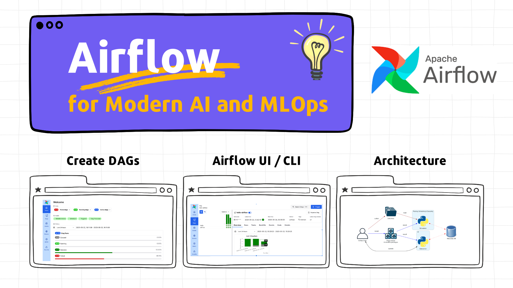
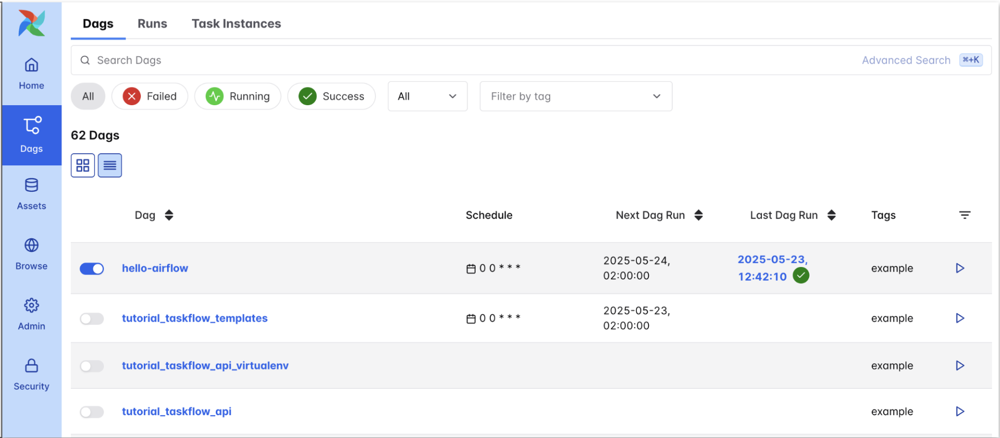
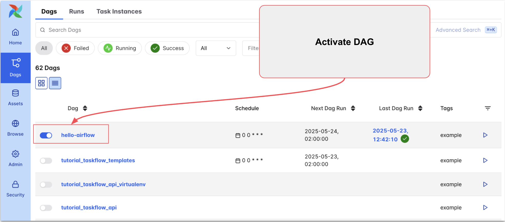
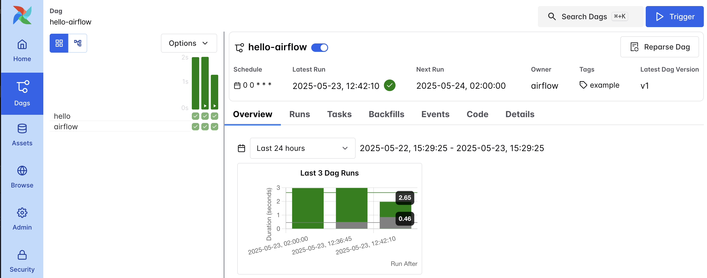
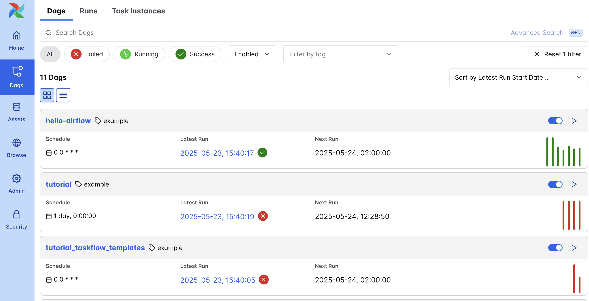
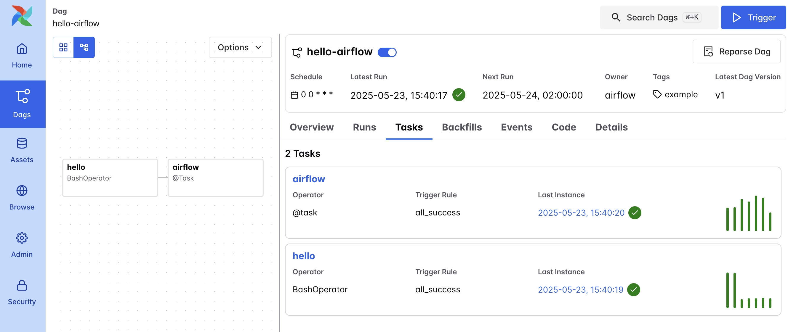
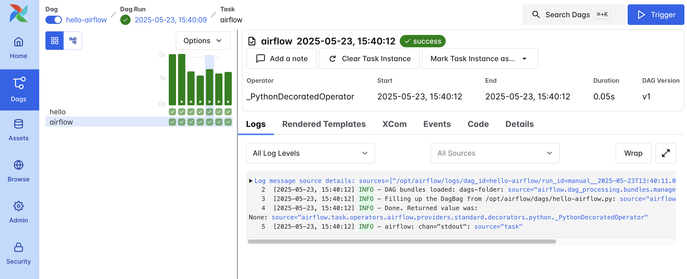
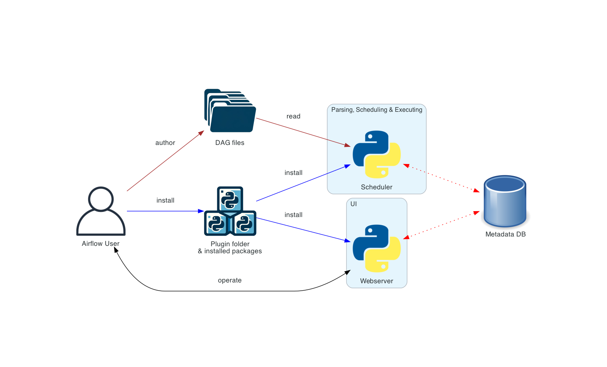

# Tutorial: Airflow Basics for Modern AI and MLOps

## 👀 Description

🎓 **What is this?** This is your new assistant - the "Airflow Basics for Modern AI and MLOps" tutorial. It's not just a set of instructions, but a comprehensive guide with examples that will teach you how to use Apache Airflow as a foundational tool for orchestrating workflows in modern AI and MLOps projects.

👩🏻‍💻 **Who is this tutorial for?** If you're a Data Scientist, aspiring ML Engineer, or anyone looking to understand how Airflow can automate and manage AI/ML pipelines, this tutorial is specifically created for you. It's suitable for both those who are just starting with Airflow and those who already have experience and want to deepen their knowledge.

**🎯 What will you learn?**

In this tutorial, you will master:

1. Installing and running Airflow
2. Creating and configuring basic DAGs using modern Airflow features
3. Managing DAG runs
4. Monitoring DAG execution and analyzing logs
5. Understanding core Airflow architecture and its relevance to MLOps pipelines

🔍 **How is it structured?** You won't have to search long for the information you need. The tutorial contains comprehensive code examples and step-by-step instructions in Markdown format.

⏱️ **How much time do you need?** Approximately 30-45 minutes - and you're one step closer to becoming a pro in managing data processing workflows and ML model applications with Airflow.

This tutorial is your ideal starting point for mastering Airflow. It will give you not only theoretical knowledge but also practical skills that you can immediately apply in your work. Don't miss the chance to improve your AI/ML workflow orchestration competencies!!

Let's begin! 😎

## 📖 Table of Contents

   1. [👀 Description](#-description)
   2. [📖 Table of Contents](#-table-of-contents)
   3. [📝 Prerequisites](#-prerequisites)
   4. [💡 1 - Why is Apache Airflow so popular?](#-1---why-is-apache-airflow-so-popular)
   5. [👩‍💻 2 - Installing and Running Airflow](#-2---installing-and-running-airflow)
   6. [🛠️ 3 - Creating and Configuring an Automated Pipeline (DAG)](#️-3---creating-and-configuring-an-automated-pipeline-dag)
      1. [Basic DAG Elements](#basic-dag-elements)
      2. [How it Works](#how-it-works)
      3. [Operators or Task Flow API?](#operators-or-task-flow-api)
   7. [🚀 4 - Running Airflow DAG: UI, CLI, Schedule](#-4---running-airflow-dag-ui-cli-schedule)
      1. [Running through User Interface (UI)](#running-through-user-interface-ui)
      2. [Running through Command Line (CLI)](#running-through-command-line-cli)
      3. [Automatic Schedule](#automatic-schedule)
   8. [📈 5 - Monitoring Execution: Interface, Statuses, Logs](#-5---monitoring-execution-interface-statuses-logs)
      1. [Activating DAGs for Pipeline Execution](#activating-dags-for-pipeline-execution)
      2. [Overview of Logs and Task Details](#overview-of-logs-and-task-details)
   9. [🏗️ 6 - Overview of Airflow Architecture and its Use in MLOps](#️-6---overview-of-airflow-architecture-and-its-use-in-mlops)
   10. [🔗 Additional Resources](#-additional-resources)

---

## 📝 Prerequisites

Before you begin, ensure you have the following installed:
- **Docker:** [Link to Docker installation guide]
- **Docker Compose:** (Usually included with Docker Desktop)
- Basic understanding of Python.
- Familiarity with the command line/terminal.

---

## 💡 1 - Why is Apache Airflow so popular?

**Apache Airflow** has become one of the most in-demand tools in the world of data automation and MLOps. Let's understand why this tool has earned such popularity.

- **Flexibility and Power:** Airflow offers exceptional flexibility for creating, scheduling, and monitoring workflows. Using Python, you can easily configure complex workflows (DAGs) that combine various tasks and dependencies. Airflow has the ability to scale for handling large volumes of tasks and data, making it suitable for companies of any size.
- **Easy Integration:** Airflow has built-in support for many popular tools and services, such as AWS, GCP, Azure, as well as databases and monitoring systems. This makes it an ideal tool for integrating diverse data systems.
- **Convenient UI and Monitoring:** Airflow provides an intuitive web interface for managing and monitoring workflows. This simplifies tracking task execution, analyzing logs, and quickly resolving issues.
- **Application in MLOps:** In the MLOps world, Airflow has proven itself as a powerful tool for orchestrating machine learning. It's excellent for automating ML model training, testing, and deployment processes, as well as data management.
- **Open Source:** Being an open-source project, Airflow allows users to modify and extend its functionality, adapting it to unique project requirements.

The popularity of Apache Airflow is due to its powerful workflow orchestration capabilities, flexibility, ease of integration, active community, and application in various fields, from data processing to MLOps. This makes it an indispensable tool in a data specialist's arsenal.

---

## 👩‍💻 2 - Installing and Running Airflow

Apache Airflow can be installed as a regular Python library or run in a Docker container. However, the best option is installation in Docker, as it provides a more convenient and stable environment.

Please follow these steps from the README:

1. [Installation instructions](README.md#-installation) to set up your Airflow environment
2. [Launch Airflow](README.md#-launch-airflow) to start the services

The web interface will be available at: [http://localhost:8080](http://localhost:8080/).



After completing these steps, you will have a fully configured environment for working with Airflow in Docker.

---

## 🛠️ 3 - Creating and Configuring an Automated Pipeline (DAG)

In this section of the tutorial, we'll look at how to create and configure an automated pipeline in Apache Airflow using DAG (Directed Acyclic Graph). A DAG in Airflow is a workflow consisting of a set of tasks. Let's consider this using the example of a simple `hello-airflow` pipeline.

Create a file named `hello-airflow.py` inside your `./dags` directory (e.g., `my-airflow-project/dags/hello-airflow.py`):

```python
from datetime import datetime
from airflow import DAG
from airflow.decorators import task
from airflow.operators.bash import BashOperator

# A DAG represents a workflow, a collection of tasks
with DAG(dag_id="hello-airflow", start_date=datetime(2022, 1, 1), schedule="0 0 * * *", tags=["example"]) as dag:

    # Tasks are represented as operators
    hello = BashOperator(task_id="hello", bash_command="echo hello")

    @task()
    def airflow():
        print("airflow")

    # Set dependencies between tasks
    hello >> airflow()
```

### Basic DAG Elements

1. **DAG Definition**: `with DAG(...) as dag` - creates a new DAG with an identifier, start date, schedule, and tags. Here `dag_id="hello-airflow"` is the unique identifier for the DAG.
2. **Tasks**: Tasks are defined as operators. In our example, we use `BashOperator` to execute the bash command `echo hello`. This task gets the identifier `task_id="hello"`.
3. **Python Functions as Tasks**: Using the `@task()` decorator, you can define a custom function as an Airflow task. In our example, the `airflow()` function simply prints "airflow".
4. **Setting Dependencies**: The `>>` operator is used to set dependencies between tasks. In this case, the `hello` task must execute before `airflow()`.

### How it Works

- When Airflow executes the `hello-airflow` DAG, it first runs the `hello` task, which executes the `echo hello` command.
- After successful execution of the `hello` task, the `airflow()` task runs, which prints "airflow".

Let's examine the DAG configuration in detail:

```python
with DAG(dag_id="hello-airflow", start_date=datetime(2022, 1, 1), schedule="0 0 * * *", tags=["example"]) as dag:
```

This code defines a DAG, which represents a workflow or collection of tasks in Airflow.

1. **`dag_id`**: This is the unique identifier for your DAG. It's used by Airflow to identify and track this specific workflow. In this case, `dag_id` is `"hello-airflow"`.
2. **`start_date`**: This is the date and time from which Airflow will start executing tasks in the DAG. It tells Airflow when to first run the workflow. In the example, `start_date` is set to `datetime(2022, 1, 1)`, meaning the first workflow run will start on January 1, 2022.
3. **`schedule`**: This parameter determines how often Airflow should run your DAG. It can be specified in various formats, including cron-like strings or Python timedelta objects. In this case, `schedule="0 0 * * *"` means the DAG will run daily at midnight. This cron expression corresponds to the format `minute hour day_of_month month day_of_week`.
4. **`tags`**: This is a list of tags that can be used to categorize and simplify searching for your DAGs in the Airflow UI. In the example, we use the tag `["example"]`.

The `with DAG(...) as dag:` construct creates a context in which you can define tasks belonging to this DAG. All tasks defined within this block will be automatically assigned to this DAG.

Once you've defined your DAG with these settings, Airflow will run it according to the specified schedule and start date, and your tasks will execute according to the dependencies you've defined.

> 👉 **Tip: TaskFlow API for Python Tasks**
>
> The TaskFlow API is generally recommended for Python-based tasks as it leads to more readable and Pythonic DAG code, simplifying development, especially for common AI/ML data processing steps.

### Operators or Task Flow API?

In Apache Airflow, tasks can be defined in two main ways: through operators and using the Task Flow API. Let's look at the difference between these approaches using the example of two tasks:

**Tasks using Operators**

Operators in Airflow are objects that define single tasks. Each operator represents a specific type of work to be performed. For example:

```python
hello = BashOperator(task_id="hello", bash_command="echo hello")
```

In this case, `BashOperator` is used to create a task that executes a `bash` command. Each operator has its own parameters, in this case `task_id` and `bash_command`. This approach is typically used in Airflow for defining tasks, especially when they involve external processes like executing bash scripts, SQL queries, working with Kubernetes, etc.

**Tasks using Task Flow API**

The Task Flow API in Airflow allows you to define tasks using the `@task` decorator. This approach makes the code more Pythonic and allows you to write tasks as regular Python functions. For example:

```python
@task()
def airflow():
    print("airflow")
```

Here, the `airflow` task is defined as a Python function. The Task Flow API automatically wraps this function in an Airflow task. This makes the code more readable and allows easy integration of complex Python logic within tasks.

**Key Differences**

1. **Syntax**: Operators use a more declarative approach, while the Task Flow API is oriented toward writing Python functions.
2. **Flexibility**: The Task Flow API offers greater flexibility for writing custom logic and better integration with Python code.
3. **Usage**: Operators are ideal for standard tasks and interaction with external services, while the Task Flow API is better suited for complex logic and data manipulation.

Both approaches can be used in a single DAG, providing great flexibility when building workflows in Airflow.

This example shows the basics of creating a DAG in Airflow, including defining tasks and their relationships. This way, you can automate and orchestrate complex workflows using Airflow's powerful features.

---

## 🚀 4 - Running Airflow DAG: UI, CLI, Schedule

You can run a DAG in Airflow in several ways: through the user interface (UI), command line (CLI), or using an automatic schedule. Let's look at each of these methods using the example of the `hello-airflow` DAG.

### Running through User Interface (UI)

Airflow provides an intuitive web interface that allows you to manage and run DAGs.

On the main page, find the list of available DAGs and select `hello-airflow`. If the DAG is not activated, toggle the switch to the left of the DAG name to activate it.



If you now go to the `hello-airflow` DAG page, you can see run details, logs, and other useful information. Click on the DAG to open its detailed page and then click the "Trigger DAG" button to run it.



### Running through Command Line (CLI)

To get started, launch an interactive shell session in the Airflow webserver container. You can find its name by running `docker ps`. It will typically be named something like `your-project-name_airflow-webserver_1`. Replace `your-airflow-webserver-container-name` below:"

```bash
docker exec -ti airflow-1-get-started-airflow-apiserver-1 /bin/bash
```

1. Running the DAG: To run `hello-airflow`, use the following command:
    
    ```bash
    airflow dags trigger hello-airflow
    ```
    
2. Monitoring Execution: You can check the DAG execution status using the `airflow dags list` or `airflow tasks list` commands.

### Automatic Schedule

DAGs in Airflow can be configured to run automatically according to a defined schedule.

1. The schedule in the `hello-airflow` DAG is set to run daily at midnight (`schedule="0 0 * * *"`).
2. After activating the DAG, Airflow will automatically run it according to the schedule.

---

## 📈 5 - Monitoring Execution: Interface, Statuses, Logs

In the Airflow UI, you can manage and monitor your DAGs, which are sets of tasks executed in a specific order. Here are the main interface elements:

### Activating DAGs for Pipeline Execution

By default, all DAGs in Airflow are deactivated. Activate DAGs to execute pipelines.


For active DAGs, you can see how many tasks have been completed successfully, how many have failed, or which ones are currently running. Click on the DAG name to see DAG details.



### Overview of Logs and Task Details

In the DAG Grid View, you can see a visual representation of task execution on a timeline. The top part shows how long each sequence takes to execute, and the bottom part shows the status of individual tasks.


For each DAG run, you can view a graph showing the relationships between tasks and their statuses.



Viewing the logs of each task can be very helpful. These logs are invaluable when debugging your DAGs. These logs are invaluable when debugging your DAGs, especially for complex MLOps pipelines where individual steps (like data validation or model training) might fail



These Airflow UI elements will help you effectively manage and monitor your workflows.

---

## 🏗️ 6 - Overview of Airflow Architecture and its Use in MLOps

Understanding Airflow's core architecture helps in appreciating how it manages and executes your automated pipelines, especially when considering more complex MLOps workflows.

Airflow has a modular architecture with several key components working together:


*Source: [Apache Airflow Core Concepts Overview](https://airflow.apache.org/docs/apache-airflow/stable/core-concepts/overview.html)*

- **Scheduler:** Monitors all your DAGs and their tasks. It triggers scheduled DAG runs and sends tasks to the Executor when they are ready.
- **Executor:** Defines *how* and *where* tasks are run. When the Scheduler identifies a task to run, it's passed to the Executor. This tutorial implicitly uses the `LocalExecutor` (tasks run on the same machine as the scheduler). For MLOps at scale, `CeleryExecutor` or `KubernetesExecutor` are common, distributing tasks to Workers.
- **Workers:** (Primarily for distributed Executors like Celery/Kubernetes) These are the processes/machines that actually execute the tasks assigned by the Executor.
- **Web Server:** Provides the user interface (UI) you've been using to monitor DAGs, view logs, and manage your Airflow instance.
- **Metadata Database:** Stores the state of all DAGs, task instances, runs, connections, and other critical information. All Airflow components interact with this database.

**How this relates to MLOps:**

While our `hello-airflow` DAG is simple, its underlying structure (defining tasks and their dependencies) is the foundation for building and managing sophisticated MLOps pipelines. The architectural components above enable Airflow to:

- **Orchestrate Complex AI/ML Workflows:** In a typical MLOps lifecycle, Airflow can sequence tasks like:
  - **Data Ingestion & Validation:** Fetching data from various sources, ensuring its quality.
  - **Data Preprocessing & Feature Engineering:** Cleaning data, transforming it, and creating features for model training.
  - **Model Training:** Triggering training scripts (which could be Python scripts, Spark jobs, or containerized tasks on Kubernetes).
  - **Model Evaluation & Versioning:** Assessing model performance and integrating with model registries.
  - **Model Deployment:** Automating the rollout of models to serving environments.
  - **Scheduled Batch Inference & Monitoring:** Running models on new data and tracking their performance over time.
- **Ensure Reliability and Order:** The Scheduler ensures these steps run in the correct order, retrying failed tasks as configured.
- **Scale Operations:** Executors like `CeleryExecutor` or `KubernetesExecutor` allow resource-intensive ML tasks (like training large models or processing big datasets) to be distributed and run efficiently.
- **Provide Centralized Monitoring:** The Web Server offers a single pane of glass to monitor the status of these often long-running and multi-step MLOps processes.

It's important to note that when designing DAGs for distributed environments (common in MLOps):
- Tasks can be executed on different Workers, potentially on different machines or containers.
- All necessary dependencies (libraries, code) and environment configurations must be available on all potential Workers.
- Task results and intermediate data (especially larger datasets or model artifacts) are typically stored in shared, remote storage (e.g., cloud storage like AWS S3, Google Cloud Storage, or Azure Blob Storage) accessible by all relevant tasks. Airflow tasks then orchestrate the reading and writing to these locations.

This architecture makes Airflow a powerful and flexible tool for automating, scheduling, and monitoring the end-to-end lifecycle of AI and machine learning models.

---

# Daily Papers Parser

This is a DAG example for daily parsing and processing new papers on AI and ML topics. 

The DAG stored in `dag/daily_papers_parser.py` and reuses functions from modules:

```
dags/src/
├── __init__.py          # Package initialization
├── config.py            # Configuration constants and settings
├── parsers.py           # Web scraping and parsing functions
├── classifiers.py       # MLOps relevance classification logic
├── storage.py           # Data saving and file operations
├── reports.py           # Report generation functionality
├── utils.py             # Common utility functions
└── README.md            # This documentation
```

## Module Descriptions

### `config.py`
Contains all configuration constants:
- `DATA_SOURCES`: URLs for different paper sources (HuggingFace, ArXiv categories)
- `MLOPS_KEYWORDS`: Keywords for MLOps relevance classification
- `TOOLS_PATTERNS`: Regex patterns for extracting tools and technologies
- `DEFAULT_HEADERS`: HTTP headers for web scraping
- Configuration constants for parsing limits and timeouts

### `parsers.py`
Web scraping and parsing functions:
- `parse_huggingface_papers()`: Parse papers from HuggingFace daily papers
- `parse_arxiv_category()`: Parse papers from a specific ArXiv category
- `parse_all_arxiv_papers()`: Parse papers from all configured ArXiv categories
- `combine_papers()`: Combine papers from multiple sources

### `classifiers.py`
Classification and analysis functions:
- `calculate_mlops_score()`: Calculate MLOps relevance score
- `extract_tools_from_text()`: Extract mentioned tools and technologies
- `generate_mlops_summary()`: Generate summary for MLOps-relevant papers
- `classify_paper_mlops_relevance()`: Classify a single paper
- `classify_papers_mlops_relevance()`: Classify multiple papers

### `storage.py`
Data storage and file operations:
- `save_raw_data()`: Save raw paper data to CSV
- `save_processed_data()`: Save processed/classified data to CSV
- `load_processed_data()`: Load processed data from CSV
- `get_file_path()`: Generate file paths for data storage
- `save_papers_to_csv()`: Generic CSV saving function

### `reports.py`
Report generation functionality:
- `generate_summary_report()`: Generate daily summary report
- `generate_detailed_report()`: Generate detailed statistics report
- `analyze_paper_sources()`: Analyze papers by source
- `analyze_top_tools()`: Analyze most mentioned tools
- `get_sample_titles()`: Get sample paper titles

### `utils.py`
Common utility functions:
- `setup_logging()`: Configure logging
- `validate_paper_data()`: Validate paper data structure
- `clean_text()`: Clean and normalize text content
- `format_date_for_filename()`: Format dates for filenames
- `ensure_data_directory()`: Ensure data directories exist
- `count_papers_by_source()`: Count papers by source


### In Airflow DAG

```python
from src.parsers import parse_huggingface_papers, parse_all_arxiv_papers
from src.classifiers import classify_papers_mlops_relevance
from src.storage import save_raw_data, save_processed_data
from src.reports import generate_summary_report

# Use in Airflow tasks
@task
def parse_papers_task():
    hf_papers = parse_huggingface_papers()
    arxiv_papers = parse_all_arxiv_papers()
    return combine_papers(hf_papers, arxiv_papers)
```

## Testing

Run the comprehensive test suite:
```bash
python scripts/test_paper_parsing.py
```

The test script validates:
- Individual module functionality
- Integration between modules
- End-to-end pipeline execution
- Data storage and retrieval
- Report generation

## Configuration

Modify `config.py` to:
- Add new paper sources
- Update MLOps keywords
- Configure parsing limits
- Adjust tool detection patterns

## Extending the System

**Adding New Paper Sources**
1. Add source URL to `DATA_SOURCES` in `config.py`
2. Create parser function in `parsers.py`
3. Update `parse_all_sources()` to include new source

**Adding New Classification Categories**
1. Add keywords to `config.py`
2. Create classification function in `classifiers.py`
3. Update main classification logic

**Adding New Storage Backends**
1. Create new storage functions in `storage.py`
2. Update DAG to use new storage options


## 🔗 Additional Resources

- [Airflow docs: Running Airflow in Docker](https://airflow.apache.org/docs/apache-airflow/stable/howto/docker-compose/index.html#using-custom-images)
- [Airflow docs: Setting Configuration Options](https://airflow.apache.org/docs/apache-airflow/stable/howto/set-config.html)
- [Airflow docs: Celery Executor](https://airflow.apache.org/docs/apache-airflow/stable/core-concepts/executor/celery.html)
- [Airflow Core Concepts Overview](https://airflow.apache.org/docs/apache-airflow/stable/core-concepts/overview.html)


[⬆️ Table of Contents](#-table-of-contents)
